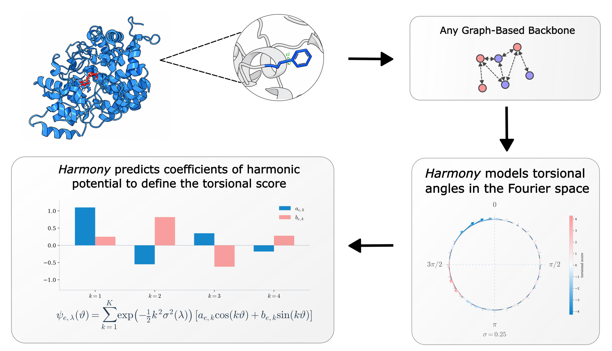

# Harmony: Harmonic Torsional Diffusion for Protein-Ligand Flexible Docking

<div align="center">
  <a href="#" target="_blank">Maksim&nbsp;Zhdanov</a> &emsp; <b>&middot;</b> &emsp;
  <a href="#" target="_blank">Pavel&nbsp;Strashnov</a> &emsp; <b>&middot;</b> &emsp;
  <a href="#" target="_blank">Vladislav&nbsp;Kurenkov</a>
  <br> <br>
  <a href="#" target="_blank">Link&nbsp;to&nbsp;paper</a> &emsp; <b>&middot;</b> &emsp;
  <a href="#" target="_blank">Project&nbsp;Page</a> &emsp;
</div>

<br>
<br>

<div align="center">
  
</div>

<br>
<br>

*Abstract.* Molecular docking requires reasoning jointly about ligand pose and protein flexibility. Most diffusion-based docking models predict torsional updates with generic Euclidean heads that ignore the periodic geometry of angular variables. This mismatch is especially limiting in flexible docking, where ligand conformations and pocket side chains co-adapt to form the bound complex. Here, we introduce Harmony, a harmonic torsional diffusion framework for flexible protein-ligand docking. Harmony parameterizes ligand and side-chain torsional score fields as derivatives of learned harmonic potentials on the circle, whose noise-level dependence is supplied analytically by the heat semigroup of variance-exploding diffusion on the torus. This construction makes periodicity explicit and gives the model a frequency-aware inductive bias over rotameric motion. On the PDBBind benchmark, Harmony improves ligand pose accuracy and pocket all-atom reconstruction over recent flexible docking methods. On PoseBusters, it improves the physical validity of generated complexes. Case studies on EBNA1 and KRAS G12D illustrate the method's behavior on a polar and a shallow binding site, respectively. Together, these results indicate that aligning the score parameterization with the geometry of the diffusion process is a simple and effective lever for improving flexible docking.

This repository contains training, inference, evaluation, and single-complex prediction code for the model.

## Setup

Use either the Dockerfile or install the Python requirements in your own environment.

Docker:

```bash
docker build -t harmony .
docker run --gpus all --ipc=host -it \
  -v "$PWD":/workspace/harmony \
  -w /workspace/harmony \
  harmony bash
```

Python environment:

```bash
pip install -r requirements.txt
```

## Data

Data preprocessing, including processed complex caches and ESM embedding files, can be prepared following the FlexDock preprocessing workflow: [vsomnath/flexdock](https://github.com/vsomnath/flexdock).

Harmony training expects cached graph files and precomputed ESM embeddings. Configure these paths in the YAML config:

```yaml
data:
  cache_path: /path/to/cache
  split_train: /path/to/train_split.txt
  split_val: /path/to/val_split.txt
  affinity_csv: /path/to/metadata.csv

model:
  esm_embeddings_path: /path/to/esm_embeddings
```

## Checkpoint

A Harmony checkpoint is provided in GitHub Releases. A trained run directory should contain:

```text
model_parameters.yml
best_inference_epoch_model_valinf_rmsds_lt2.pt
```

Use `model_parameters.yml` as the config path for inference. Override paths such as the checkpoint, input CSV, output directory, and ESM embeddings from the command line when needed.

## Training

To run Harmony training, edit dataset paths, ESM embeddings path, output directory, and W&B settings in the config first.

Single GPU:

```bash
python run_training.py configs/docking_harmony.yml
```

Eight GPUs on one node:

```bash
torchrun --standalone --nproc_per_node=8 run_training.py configs/docking_harmony.yml
```

Training writes checkpoints and `model_parameters.yml` to `training.output_dir`.

## Inference

Run docking from a trained run config:

```bash
python run_inference.py /path/to/run/model_parameters.yml \
  inference.checkpoint=/path/to/run/best_inference_epoch_model_valinf_rmsds_lt2.pt \
  inference.input_csv=/path/to/inference.csv \
  inference.output_dir=/path/to/predictions \
  inference.esm_embeddings_path=/path/to/esm_embeddings
```

Predictions are written to:

```text
<inference.output_dir>/<complex_name>/docking_predictions.pkl
```

## Evaluation

Evaluate saved predictions:

```bash
python run_evaluate_inference.py /path/to/run/model_parameters.yml \
  inference.input_csv=/path/to/inference.csv \
  inference.output_dir=/path/to/predictions \
  inference.results_table_csv=/path/to/results.csv \
  inference.esm_embeddings_path=/path/to/esm_embeddings
```

For PoseBusters evaluation, change paths and add:

```bash
inference.posebusters_metrics=true
```

## Single-Sample Inference

Run prediction for one apo protein and one ligand file:

```bash
python run_predict_folder.py /path/to/input_folder \
  --protein /path/to/apo_protein.pdb \
  --ligand /path/to/ligand.sdf \
  --name complex_id \
  --model-parameters /path/to/run/model_parameters.yml \
  --weights /path/to/run/best_inference_epoch_model_valinf_rmsds_lt2.pt \
  --esm-embeddings-path /path/to/esm_embeddings \
  --output-dir /path/to/output \
  --samples 10 \
  --steps 20 \
  --device cuda
```

Optional reference files enable RMSD and PoseBusters reference metrics:

```bash
python run_predict_folder.py /path/to/input_folder \
  --protein /path/to/apo_protein.pdb \
  --ligand /path/to/ligand.sdf \
  --reference-protein /path/to/holo_protein.pdb \
  --reference-ligand /path/to/native_ligand.sdf \
  --name complex_id \
  --model-parameters /path/to/run/model_parameters.yml \
  --weights /path/to/run/best_inference_epoch_model_valinf_rmsds_lt2.pt \
  --esm-embeddings-path /path/to/esm_embeddings \
  --output-dir /path/to/output \
  --posebusters
```

The script writes the confidence-selected predicted protein, ligand, and complex structures:

```text
<output_dir>/<complex_name>/predictionN_protein.pdb
<output_dir>/<complex_name>/predictionN_ligand.sdf
<output_dir>/<complex_name>/predictionN_complex.pdb
```

## Harmony Head Pseudocode

The Harmony idea can be added to an existing torsional docking model by replacing the scalar torsion head with a small Fourier head. The rest of the docking model can stay unchanged.

For each rotatable torsion, let `h_i` be the hidden feature for that torsion, `theta_i` the current noisy torsion angle, and `sigma_i` the torsional noise scale. Predict Fourier coefficients instead of a single scalar update:

```python
# h: [num_torsions, hidden_dim]
# theta: [num_torsions], wrapped angle in radians
# sigma: [num_torsions], torsional VE noise scale
# K: number of Fourier modes

coeff = fourier_head(h)                     # [num_torsions, 2 * K]
coeff = coeff.view(num_torsions, K, 2)
a = coeff[..., 0]                           # cosine coefficients
b = coeff[..., 1]                           # sine coefficients

k = arange(1, K + 1).view(1, K)             # Fourier modes 1, ..., K
phase = theta.view(num_torsions, 1) * k
```

For VE torsional diffusion, apply the damping factor for each Fourier mode:

```python
heat_gate = exp(-0.5 * (k ** 2) * (sigma.view(num_torsions, 1) ** 2))
```

Then compute the torsional score as the angular derivative of the learned harmonic potential:

```python
torsion_score = (k * heat_gate * (-a * sin(phase) + b * cos(phase))).sum(dim=-1)
```

Train this score with the same score-matching target used by the base torsional diffusion model:

```python
score_loss = ((torsion_score - torsion_score_target) ** 2) / score_norm(sigma) ** 2
```

Add a small smoothness penalty on the Fourier coefficients:

```python
fourier_reg = ((k ** 2) * (a ** 2 + b ** 2)).sum(dim=-1)
loss = score_loss.mean() + lambda_fourier * fourier_reg.mean()
```

Use the same construction for ligand torsions and side-chain torsions.

## License

Source code is released under the Apache 2.0 license. Please see the <a href="https://www.apache.org/licenses/LICENSE-2.0" target="_blank">LICENSE</a>. All other materials are released under the Creative Commons Attribution 4.0 International License, <a href="https://creativecommons.org/licenses/by/4.0/legalcode" target="_blank">CC-BY 4.0</a>.

## Citation

```bibtex
@article{harmony2026,
  title   = {Harmonic Torsional Diffusion for Protein-Ligand Flexible Docking},
  author  = {TODO},
  journal = {TODO},
  year    = {2026}
}
```
